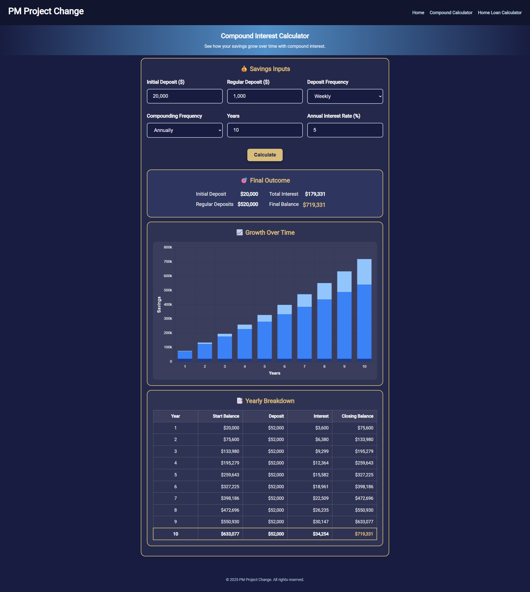
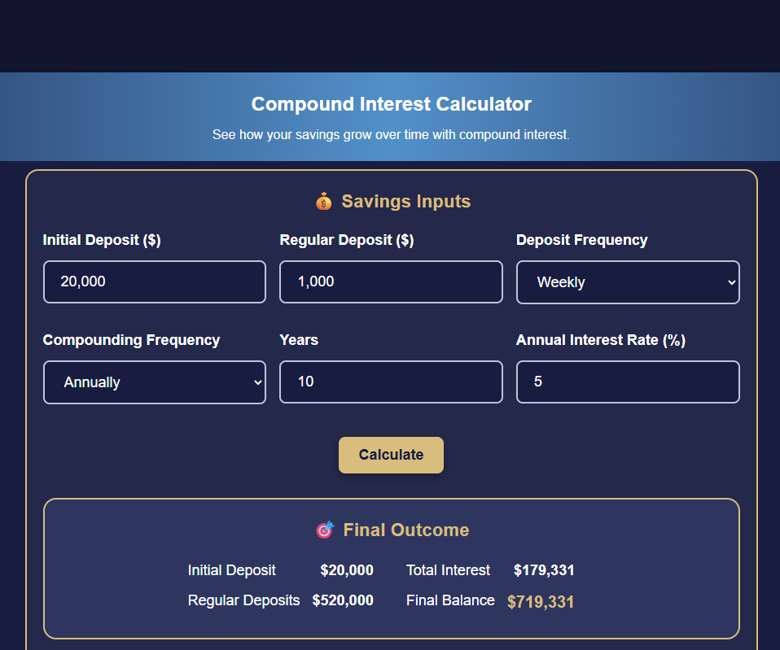
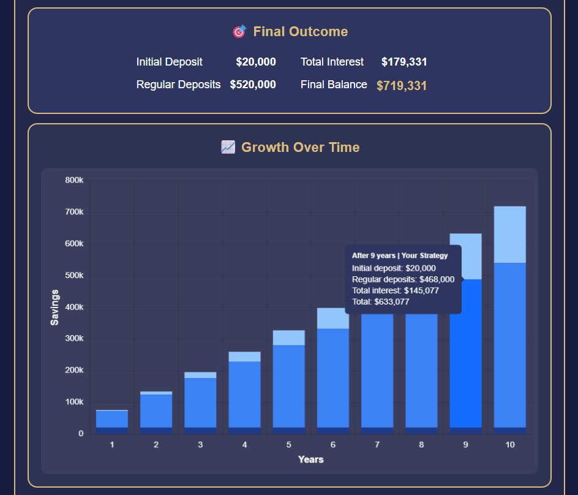
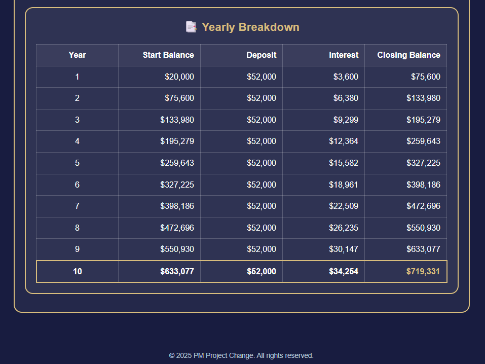

# 📈 Compound Interest Calculator 🚀

An interactive **web app** to calculate and visualize compound interest over time.  
Built with **HTML, CSS, and JavaScript** (using Chart.js for data visualization) and deployed on **Netlify**.  

🌐 **Live Demo** → [Compound Calculator](https://compoundcalculatordemo.netlify.app/compound)  
💻 **Source Code** → [GitHub Repository](https://github.com/PendragonInitiatives/compound_calculator_demo)

---

## 📸 Images

### 🖥️ Full App View


### 📝 Input Form


### 📊 Growth Chart


### 📑 Yearly Breakdown


---

## 🎯 Project Highlights
- 🔢 **Compound Interest Calculator** - Handles initial deposits, recurring deposits, compounding frequency, and time horizon.  
- 📊 **Dynamic Graphs** - Real-time **growth charts** powered by Chart.js.  
- 📑 **Yearly Breakdown Tables** - Interactive data tables showing yearly start balance, deposits, interest, and closing balance.  
- 🎨 **Modern UI Design** - Clean, responsive layout with a dark theme and accessible design.  
- 🚀 **Deployed on Netlify** - Fast, secure, and auto-updated on every commit.  

---

## 🛠️ Tech Stack
**Frontend Development**  
- HTML5 - Semantic and accessible structure  
- CSS3 - Responsive styles with Flexbox and custom theme  
- JavaScript (ES6+) - Core app logic and interactivity  
- Chart.js - Data visualization for compound growth  

**Deployment**  
- Netlify - Hosting, CI/CD, and production deployment  

---

## 🏗️ Architecture Deep Dive

### Frontend Structure
```plaintext
src/
├── index.html       # Main entry point
├── styles.css       # Global styles and layout
├── script.js        # Core calculation + Chart.js integration
└── assets/          # Images, icons, and static assets
```
---
## 📊 Features in Action

### 📂 Compound Interest Formula

**Javacript code**

```javascript
function calculateCompound(principal, rate, years, frequency) {
  const compoundRate = rate / frequency;
  const periods = years * frequency;
  return principal * Math.pow(1 + compoundRate, periods);
}
```

---


### 📈 Chart.js Integration

```javascript
const ctx = document.getElementById('growthChart').getContext('2d');
const growthChart = new Chart(ctx, {
  type: 'bar',
  data: {
    labels: yearsArray,
    datasets: [{
      label: 'Closing Balance',
      data: balances,
      backgroundColor: '#4e79a7',
    }]
  },
  options: {
    responsive: true,
    plugins: {
      legend: { display: false }
    }
  }
});
```

---

### 🚀 Future Improvements

- 🔄 Add ability to export yearly breakdowns as CSV/Excel

- 💾 Store user scenarios in localStorage for later retrieval

- 📱 Convert into a PWA (Progressive Web App) for offline use

- 🖥️ Extend to full-stack with a backend for saving user strategies

---

### 📈 What This Demonstrates

- ✅ JavaScript logic implementation (compound interest formulas, DOM updates)

- ✅ Data visualization with Chart.js

- ✅ Responsive and professional UI/UX

- ✅ Deployment workflow using Netlify

- ✅ Ability to structure, document, and present projects for professional portfolios

---

### 🤝 Contributing

Contributions are welcome!

1. Fork the repo

2. Create a feature branch (git checkout -b feature/amazing-feature)

3. Commit changes (git commit -m "Add amazing feature")

4. Push (git push origin feature/amazing-feature)

5. Open a Pull Request

---

### 📄 License

This project is licensed under the MIT License.

---
